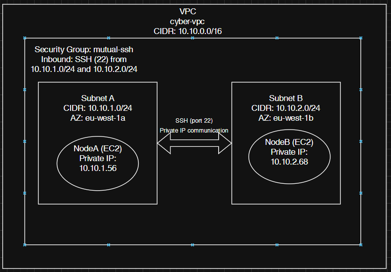

# The Link Between the Nodes – AWS Fundamentals

## Overview
This assignment demonstrates how to create a secure, private communication channel between two EC2 instances inside an AWS Virtual Private Cloud (VPC), without exposing any public IP addresses or external access.

## Architecture
- **VPC:** `cyber-vpc` (`10.10.0.0/16`)
- **Subnet A:** `10.10.1.0/24` (eu-west-1a) – NodeA
- **Subnet B:** `10.10.2.0/24` (eu-west-1b) – NodeB
- **EC2 Instances:**
  - **NodeA:** Private IP `10.10.1.56`
  - **NodeB:** Private IP `10.10.2.68`
- **Security Group:** `mutual-ssh`
  - Allows SSH (port 22) traffic only between Subnet A and Subnet B

### Architecture Diagram
The diagram below illustrates the VPC layout, private subnets, EC2 instances, and internal SSH communication.

## Access Method
Both EC2 instances are deployed in private subnets with no public IP addresses.  
To securely access the instances for administration, an **EC2 Instance Connect Endpoint** was created in the VPC. This enables SSH access to private instances without requiring a bastion host, an Internet Gateway, or a NAT Gateway.

## Validation
The following connectivity tests were successfully completed:
- SSH connection from **NodeA → NodeB** using the private IP address
- SSH connection from **NodeB → NodeA** using the private IP address

Screenshots demonstrating the successful connectivity between the instances are available in the **`/photos`** folder.
