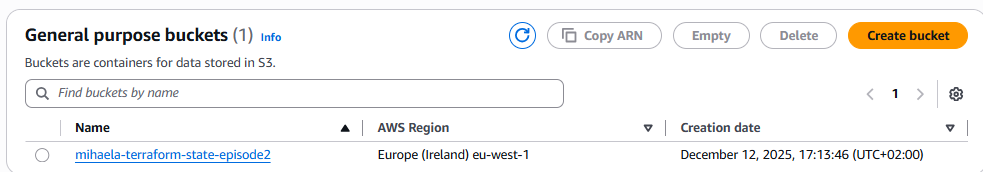
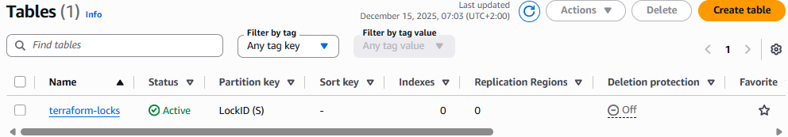
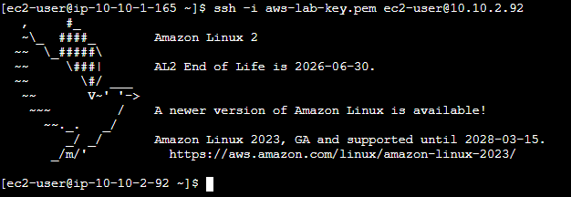
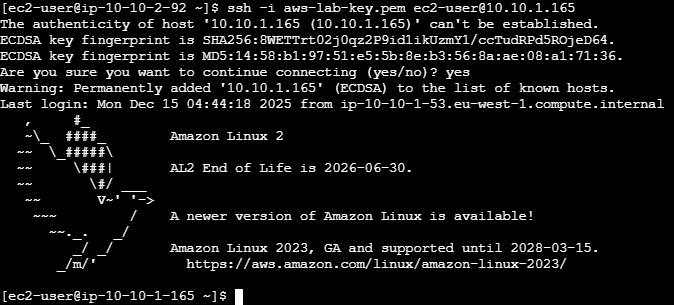
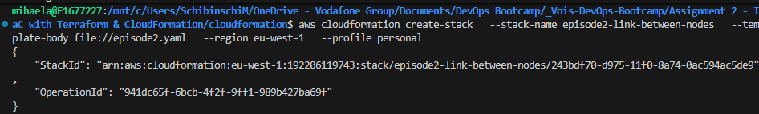
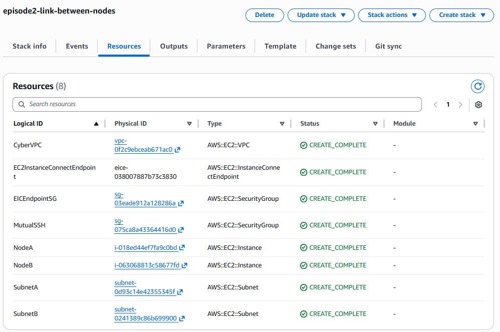

# Assignment 2 – The Link Between the Nodes (Episode 2)
## Rewritten in Code – Terraform & CloudFormation

This assignment demonstrates how to provision and validate secure,
private communication between two EC2 instances inside an AWS VPC
using Infrastructure as Code.

The same architecture was implemented twice:
- using **Terraform**
- using **CloudFormation** (side quest)

Both implementations deploy **two private EC2 instances**, without
public IP addresses, communicating exclusively via **private IPs**.

---

## Architecture Overview

- **VPC:** `cyber-vpc` (`10.10.0.0/16`)
- **Subnet A:** `10.10.1.0/24` (eu-west-1a)
- **Subnet B:** `10.10.2.0/24` (eu-west-1b)
- **Security Group:** `mutual-ssh`
  - Allows SSH (22) only between Subnet A and Subnet B
- **EC2 Instances:**
  - NodeA (Subnet A, private IP only)
  - NodeB (Subnet B, private IP only)

---

## Repository Structure

/terraform
├── main.tf
├── backend.tf
├── variables.tf
├── outputs.tf
├── versions.tf
└── photos/

/cloudformation
├── episode2.yaml
└── photos/

## Terraform Implementation

The Terraform solution provisions:
- VPC and private subnets
- Security group with restricted SSH rules
- Two EC2 instances (`t3.micro`, Amazon Linux 2)
- No public IP addresses
- Remote backend using **S3 + DynamoDB** for state and locking

### Terraform Evidence

**Remote backend configuration**
  
  

**Private SSH connectivity**
  
NodeA → NodeB  

NodeB → NodeA  

---

## CloudFormation Implementation (Side Quest)

A single-file CloudFormation template (`episode2.yaml`) recreates
the same architecture:
- VPC
- Two private subnets
- Mutual SSH security group
- Two EC2 instances without public IPs

### CloudFormation Evidence

**Stack creation**
  

**Stack details and resources**
  
  

**Private SSH connectivity**
  
NodeA → NodeB  

NodeB → NodeA  

---

## Reflection – Terraform vs CloudFormation

**Terraform**
- Easier to iterate using `plan` and `apply`
- Clear preview of changes
- Better state handling and outputs
- More flexible for complex or multi-cloud setups

**CloudFormation**
- Native AWS service
- More verbose and rigid
- Slower feedback loop compared to Terraform

**Improvements**
- Modularize Terraform configuration
- Add automated validation and cleanup steps

---

## Cleanup

All resources were removed after validation:
- `terraform destroy` for Terraform
- `aws cloudformation delete-stack` for CloudFormation