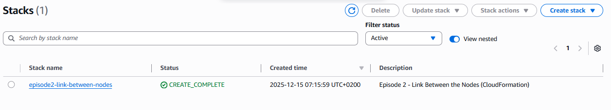
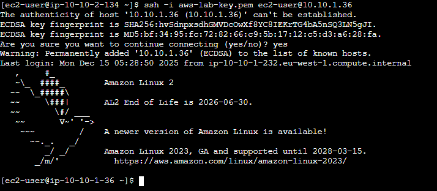

# CloudFormation – Episode 2  
## The Link Between the Nodes (Side Quest)

This directory contains the **CloudFormation implementation** for  
**Assignment 2 – The Link Between the Nodes (Episode 2)**.

The purpose of this side quest was to recreate, using **native AWS
Infrastructure as Code**, the same secure private connectivity previously
implemented with Terraform.

The setup provisions **two EC2 instances in private subnets**, with **no
public IP addresses**, communicating **only via private IPs**.

---

## Architecture Overview

The following AWS resources were provisioned:

- **VPC:** `cyber-vpc`  
  CIDR: `10.10.0.0/16`

- **Subnet A:**  
  CIDR: `10.10.1.0/24`  
  Availability Zone: `eu-west-1a`

- **Subnet B:**  
  CIDR: `10.10.2.0/24`  
  Availability Zone: `eu-west-1b`

- **Security Group:** `mutual-ssh`  
  - Allows inbound SSH (port 22)
  - Traffic permitted **only between Subnet A and Subnet B**

- **EC2 Instances:**
  - **NodeA** – deployed in Subnet A (private IP only)
  - **NodeB** – deployed in Subnet B (private IP only)

All resources are defined in a **single CloudFormation template**:

```
episode2.yaml
```

---

## Stack Deployment

The CloudFormation stack was deployed using the **AWS CLI**.

```bash
aws cloudformation create-stack \
  --stack-name episode2-link-between-nodes \
  --template-body file://episode2.yaml \
  --region eu-west-1 \
  --profile personal
```

### Stack Creation


---

## Stack Status and Resources

### Stack Details


### Stack Resources


### Stack Overview



---

## SSH Connectivity Validation

### NodeA → NodeB


### NodeB → NodeA



---

## Notes on Access

An **EC2 Instance Connect Endpoint** was used only for administrative access.
Internal communication relies strictly on **private IP connectivity**.

---

## Cleanup

```bash
aws cloudformation delete-stack \
  --stack-name episode2-link-between-nodes \
  --region eu-west-1 \
  --profile personal
```
