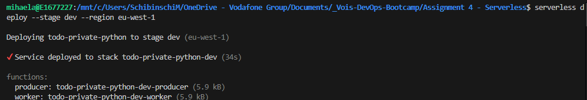
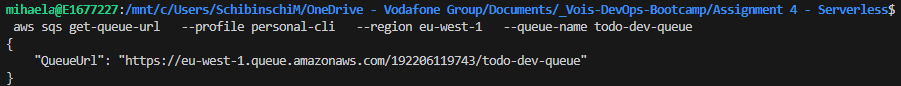
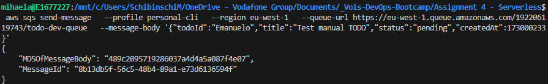
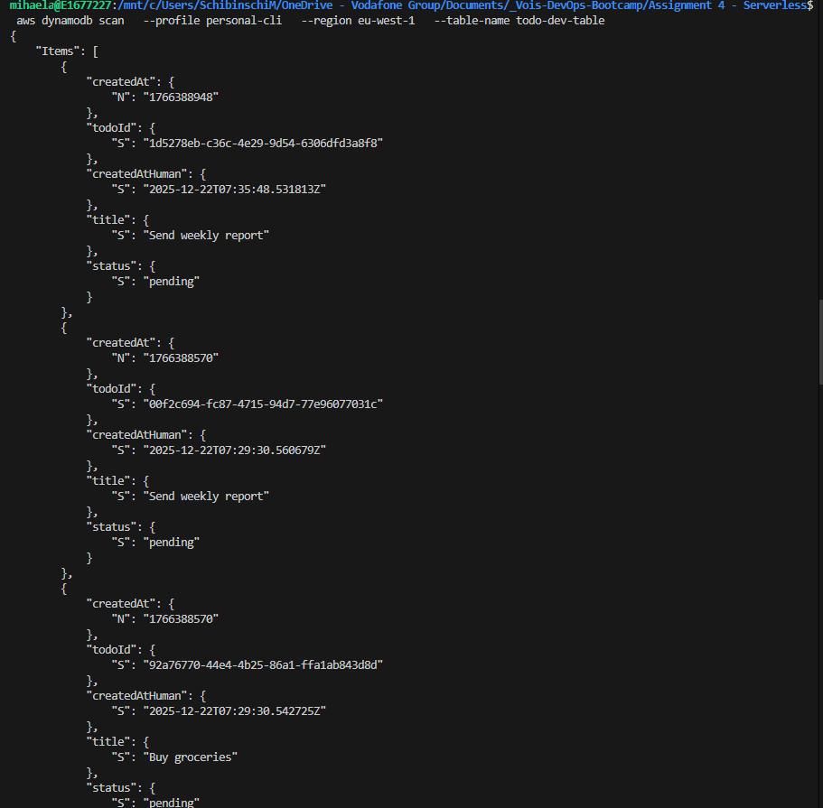
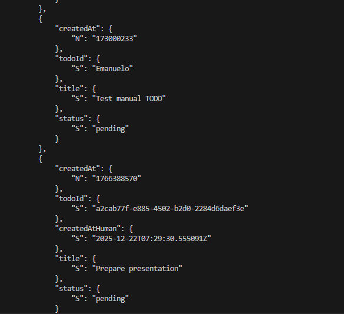
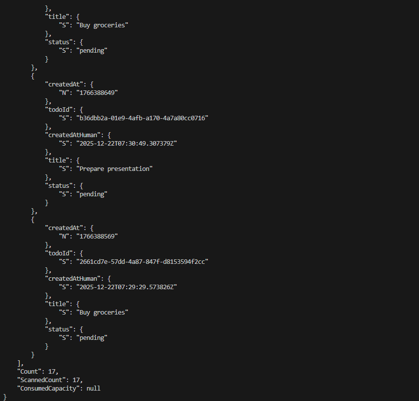
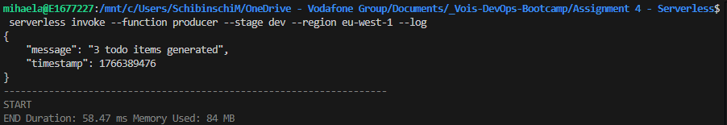
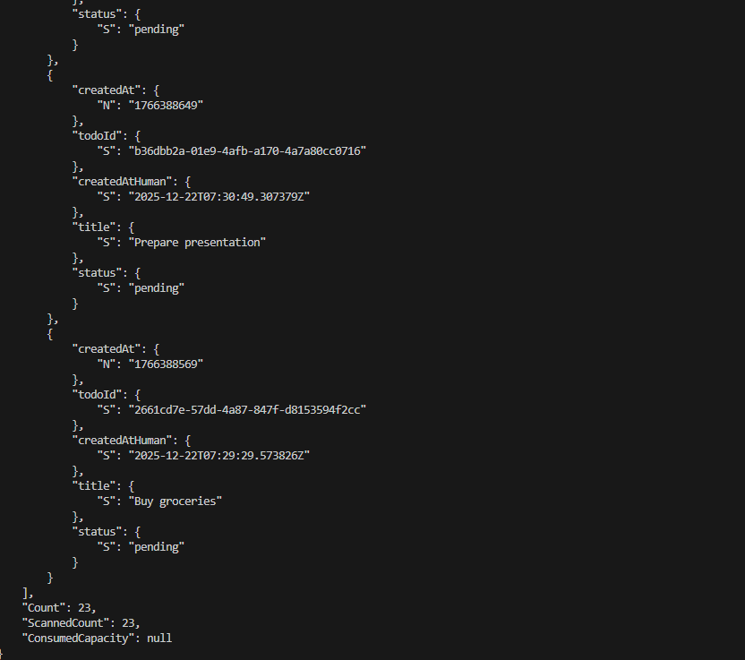

# Serverless TODO Service (Private, Multi-Environment)

This project implements a **serverless TODO service** deployed in **multiple isolated environments** (`dev`, `stage`, `prod`) using the **same Infrastructure-as-Code templates**, parameterised by stage.

---

## Architecture Overview

```
EventBridge (cron)
        |
        v
   Producer Lambda
        |
        v
      SQS Queue
        |
        v
    Worker Lambda
        |
        v
   DynamoDB Table
```

---

## Key Design Decisions (Aligned with Assignment)

- **Two Lambda functions**, both running in **private subnets**
- **No NAT Gateway**, **no Internet Gateway**, **no public IPs**
- **No public endpoints** (no API Gateway / HTTP)
- **One SQS queue** to decouple asynchronous processing
- **One DynamoDB table** for persistence
- **One Security Group per environment** (network isolation)
- **Minimal networking resources**, only what is required for functionality

---

## Networking (Private-Only)

Each environment provisions:
- One VPC
- Two private subnets
- One Security Group dedicated to Lambda functions
- **VPC Endpoints**:
  - DynamoDB (Gateway Endpoint)
  - SQS (Interface Endpoint)

### Security Group rule (required)
Because SQS is accessed via an **Interface VPC Endpoint**, the endpoint’s Security Group allows **HTTPS (443)** traffic **from the Lambda Security Group itself**.

This is the minimal rule required to allow a Lambda in a private subnet (without NAT) to send messages to SQS.

---

## Environment Isolation

Each stage (`dev`, `stage`, `prod`) has:
- Its own VPC and subnets
- Its own Security Group
- Its own SQS queue and DynamoDB table

Configuration is provided via:
```
env/dev.json
env/stage.json
env/prod.json
```

---

## Deployment (Manual Steps)

### 1. Deploy Network Stack
```bash
aws cloudformation deploy   --profile personal-cli   --region eu-west-1   --stack-name todo-dev-network   --template-file network.yml   --parameter-overrides Stage=dev
```

---

### 2. Deploy Application Stack
```bash
serverless deploy --stage dev --region eu-west-1
```


---

## Verification (End-to-End)

### 1. Get SQS Queue URL
```bash
aws sqs get-queue-url   --profile personal-cli   --region eu-west-1   --queue-name todo-dev-queue
```


---

### 2. Send a Test Message Manually
```bash
aws sqs send-message   --profile personal-cli   --region eu-west-1   --queue-url <QUEUE_URL>   --message-body '{"todoId":"manual-1","title":"Test manual todo","status":"pending","createdAt":1730000000}'
```


---

### 3. Verify DynamoDB Persistence
```bash
aws dynamodb scan   --profile personal-cli   --region eu-west-1   --table-name todo-dev-table
```




---

### 4. Test Producer Lambda
```bash
serverless invoke --function producer --stage dev --region eu-west-1 --log
```



---

### 5. Verify Scheduled Execution
The producer Lambda is configured with:
```
rate(5 minutes)
```

After waiting 5 minutes, running the DynamoDB scan again should show **additional TODO items**, confirming the scheduled execution works correctly.



---

## Cleanup

### Remove Application Stack
```bash
serverless remove --stage dev --region eu-west-1
```

### Remove Network Stack
```bash
aws cloudformation delete-stack   --profile personal-cli   --region eu-west-1   --stack-name todo-dev-network
```

---
