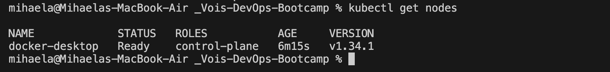
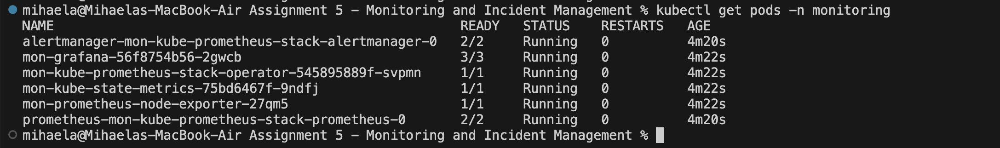
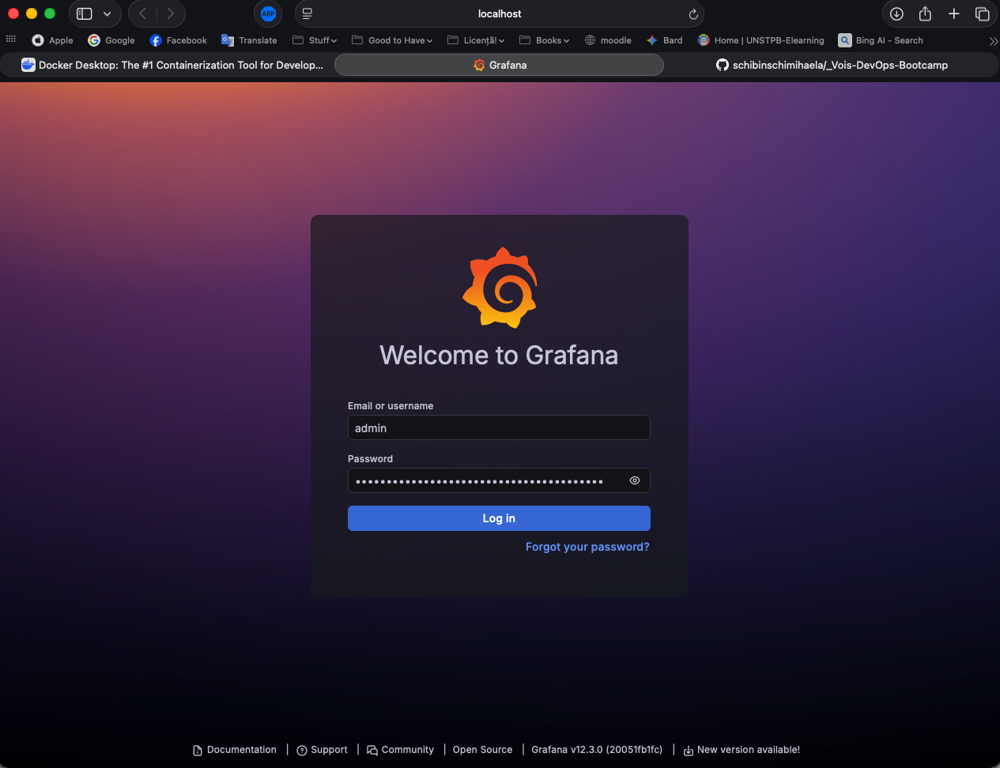
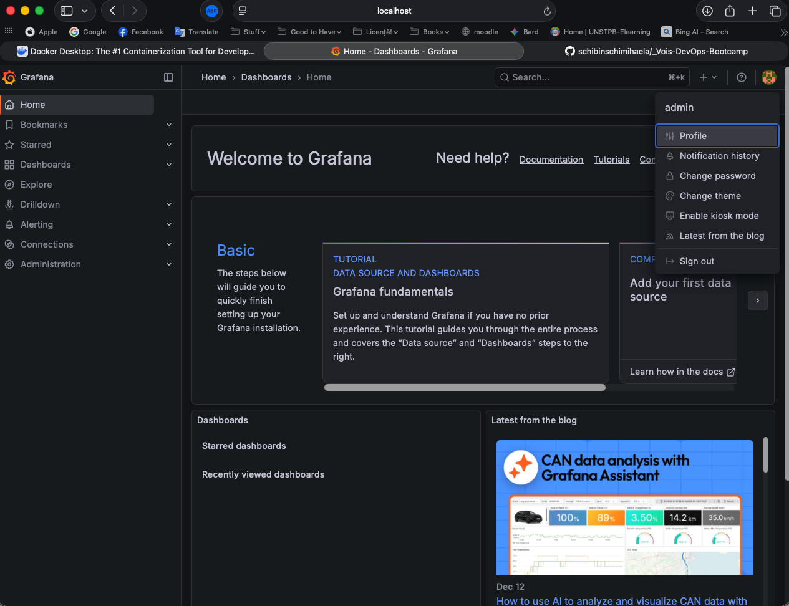
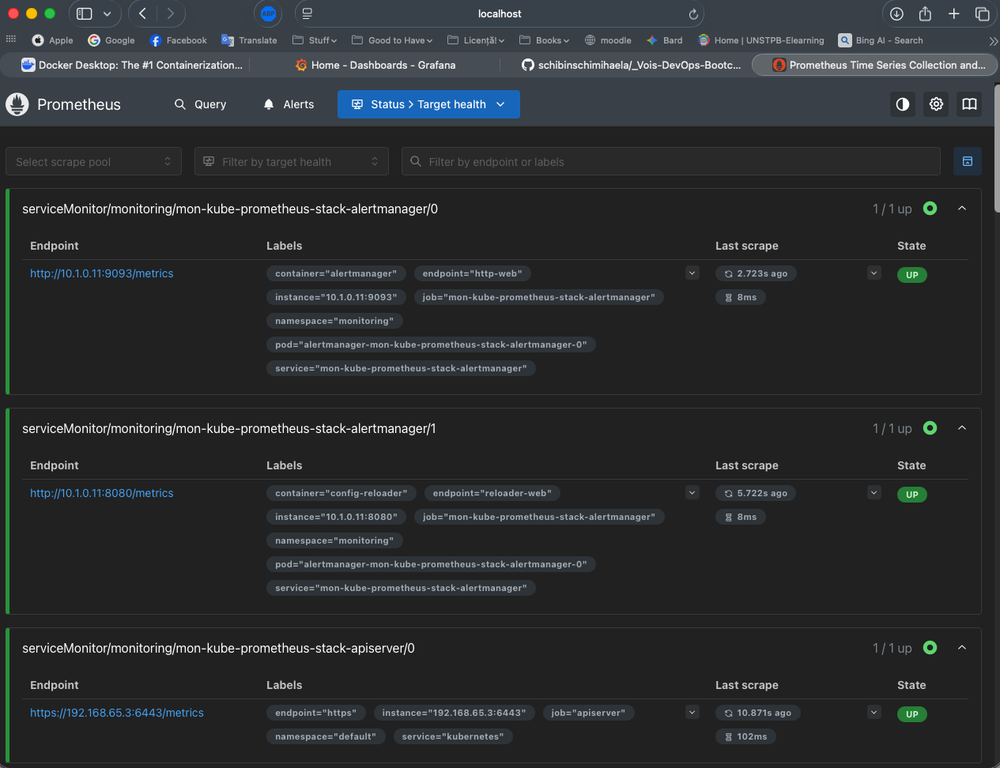
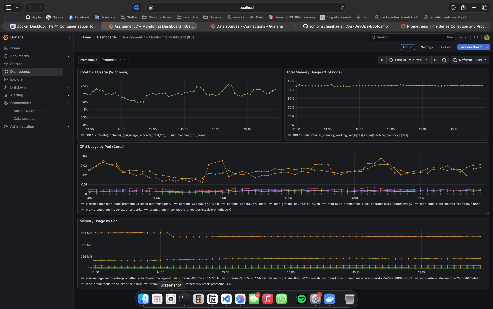
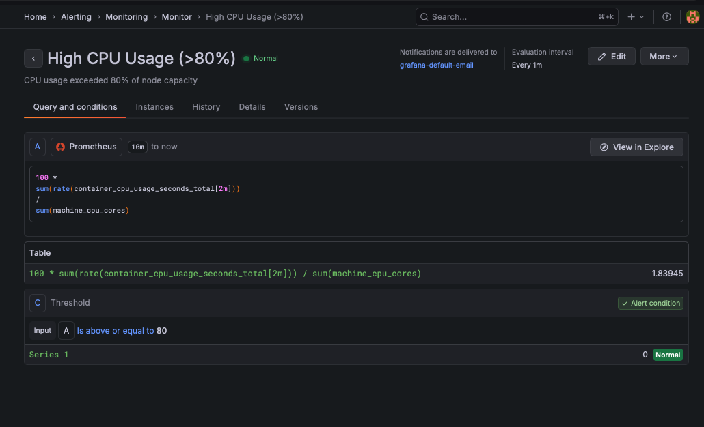
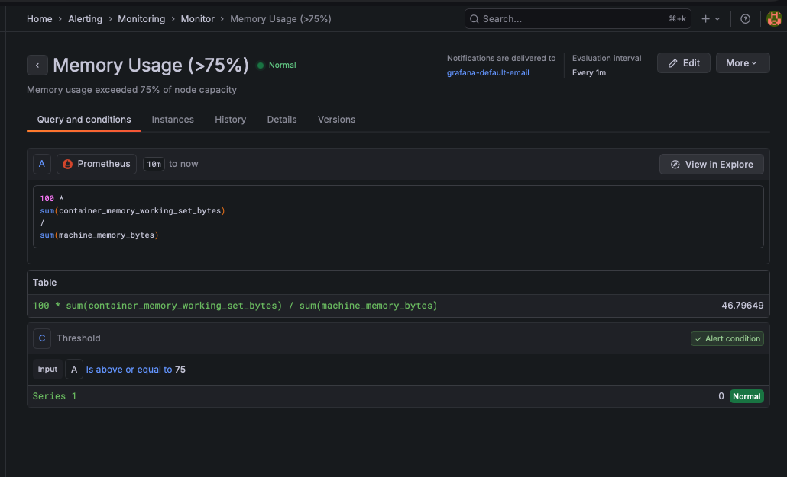

# Assignment – Monitoring & Incident Management

## Overview
This assignment demonstrates the setup of a complete monitoring and alerting solution for a Kubernetes cluster using **Prometheus**, **Grafana**, **Node Exporter**, and **cAdvisor**.  
The goal is to monitor cluster and container resources (CPU and Memory), visualize metrics using dashboards, and configure alerts for high resource usage.

The monitoring stack was deployed on a local single-node Kubernetes cluster provided by **Docker Desktop**.

---

## Section 1 — Conceptual Understanding

### 1. Proactive vs. Reactive Monitoring
- **Proactive monitoring** focuses on detecting trends and anomalies before they impact users (capacity planning, threshold alerts, SLO monitoring).
- **Reactive monitoring** responds to incidents after failures occur, usually triggered by alerts or user reports.
- In practice, both approaches are combined to minimize downtime and improve system reliability.

---

### 2. MTTD and MTTR
- **MTTD (Mean Time To Detect)** – the average time required to detect an incident.
- **MTTR (Mean Time To Recover)** – the average time required to restore a service after an incident.
- These metrics are important because reducing MTTD and MTTR directly reduces customer impact and improves operational efficiency.

---

### 3. Incident Lifecycle and DevOps Role
A typical incident lifecycle includes:
1. **Detection** – monitoring systems detect abnormal behavior.
2. **Triage** – impact and urgency are assessed.
3. **Mitigation** – actions are taken to reduce user impact (scaling, restarts, rollbacks).
4. **Recovery** – services are fully restored and verified.
5. **Post-Incident Review (RCA)** – root cause analysis and preventive improvements.

DevOps engineers are involved in all stages by maintaining monitoring, responding to alerts, fixing issues, and improving system resilience.

---

### 4. External Monitoring Platforms
- **Datadog** – SaaS monitoring with fast onboarding, unified metrics/logs/traces, and extensive integrations.
- **Elastic Observability** – strong log analytics and flexible observability based on the Elastic Stack.
- **Splunk** – enterprise-grade log analysis and correlation for complex environments.

---

## Section 2 — Monitoring Tools Exploration

### 5. Prometheus
Prometheus is an open-source monitoring system used to collect time-series metrics from applications and infrastructure via HTTP endpoints and query them using PromQL.

---

### 6. Grafana
Grafana complements Prometheus by providing dashboards, visualizations, and alerting capabilities, enabling easier analysis and interpretation of metrics.

---

### 7. Node Exporter
Node Exporter exposes host-level operating system metrics such as CPU, memory, filesystem, and network usage.  
Example metrics include:
- `node_cpu_seconds_total`
- `node_memory_MemAvailable_bytes`
- `node_network_receive_bytes_total`

---

### 8. PagerDuty
PagerDuty is an incident management and alerting platform that integrates with monitoring tools to route alerts, manage on-call schedules, and escalate incidents via multiple channels.

---

## Section 3 — Hands-On Project

## Technologies Used
- Kubernetes (Docker Desktop, single-node)
- Helm
- Prometheus (kube-prometheus-stack)
- Grafana
- Alertmanager
- Node Exporter
- cAdvisor (via kubelet)
- kube-state-metrics

---

## Cluster Setup
A local Kubernetes cluster was created using Docker Desktop and verified to be running correctly.



---

## Monitoring Stack Installation
The monitoring stack was installed using the official **kube-prometheus-stack** Helm chart:

```bash
helm repo add prometheus-community https://prometheus-community.github.io/helm-charts
helm repo update

helm install mon prometheus-community/kube-prometheus-stack   -n monitoring   -f values.yml
```



This deployment automatically installed and configured:
- Prometheus
- Grafana
- Alertmanager
- Node Exporter
- kube-state-metrics

---

## Node Exporter
Node Exporter was installed automatically as part of the Helm chart and runs as a **DaemonSet**.  
It exposes node-level system metrics which are scraped by Prometheus using a dedicated ServiceMonitor.

---

## cAdvisor
cAdvisor is integrated into the Kubernetes **kubelet** and does not run as a standalone container.  
Prometheus collects container-level metrics via the kubelet `/metrics/cadvisor` endpoint, enabled through the `mon-kube-prometheus-stack-kubelet` ServiceMonitor.

These metrics include:
- Container CPU usage
- Container memory usage

---

## Grafana Data Source
Grafana was installed via Helm and connected to Prometheus using an automatically provisioned Prometheus data source.  
No manual data source configuration was required.





---

## Grafana Dashboard
A custom Grafana dashboard was created with the following panels:
- **Total CPU Usage (% of node)**
- **Total Memory Usage (% of node)**
- **CPU Usage by Pod (cores)**
- **Memory Usage by Pod (MiB)**

System pods were filtered where appropriate to improve readability.



---

## Alert Configuration
Two threshold-based alerts were configured to detect resource exhaustion:

### High CPU Usage
- Condition: CPU usage > 80% of node capacity  
- Duration: 2m  
- PromQL:
```promql
100 * sum(rate(container_cpu_usage_seconds_total[2m])) / sum(machine_cpu_cores) > 80
```
- Purpose: proactively detect sustained CPU pressure and trigger remediation/escalation.



### High Memory Usage
- Condition: Memory usage > 75% of node capacity  
- Duration: 2m  
- PromQL:
```promql
100 * sum(container_memory_working_set_bytes) / sum(machine_memory_bytes) > 75
```
- Purpose: detect elevated memory consumption that may lead to OOMs and instability.


