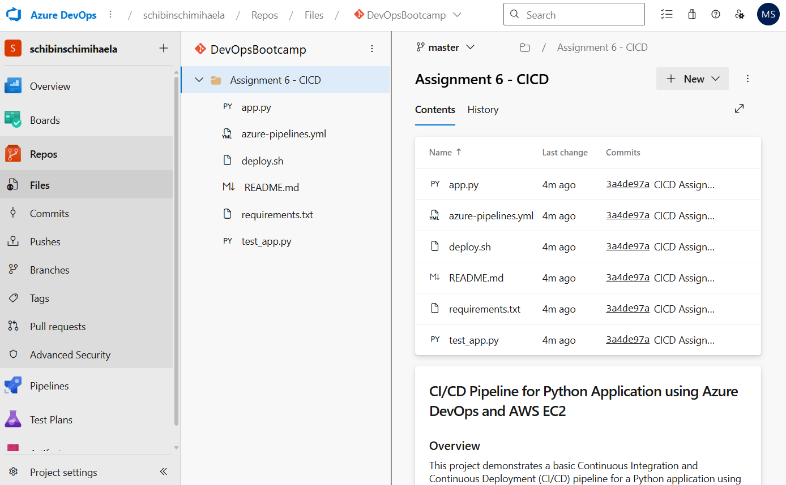
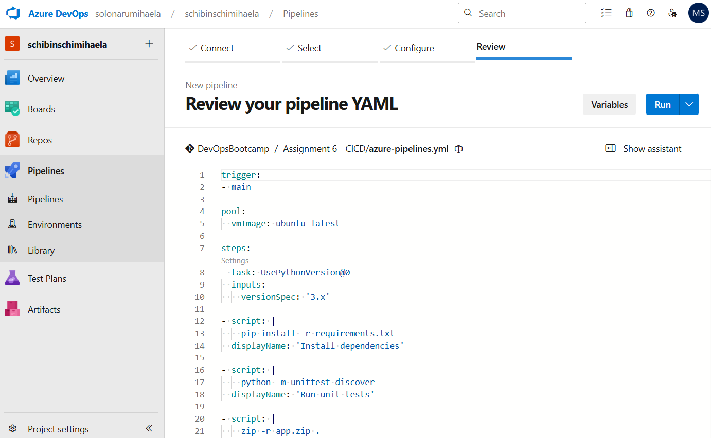
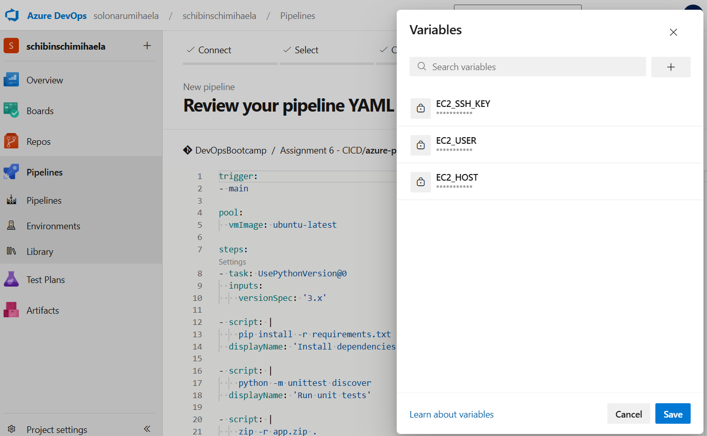

# CI/CD Pipeline for Python Application using Azure DevOps and AWS EC2

## Overview
This project demonstrates a basic Continuous Integration and Continuous Deployment (CI/CD) pipeline for a Python application using Azure DevOps and AWS EC2 (Free Tier).  
The goal of the assignment is to understand CI/CD fundamentals, pipeline configuration using YAML, secure handling of secrets, and automated deployment logic.

---

## Technologies Used
- Python 3
- Flask
- Python `unittest`
- Azure DevOps Pipelines (YAML)
- Azure Repos (Git)
- AWS EC2 (Free Tier)
- SCP and SSH for remote deployment

---

## Application Description
The application is a simple Python Flask web server that exposes a single endpoint (`/`) which returns a static message.  
A unit test is included to verify that the application responds correctly.

---

## Project Structure
```
Assignment 6 - CICD
├── photos/
│   ├── azure-pipeline-file.png
│   ├── repository.png
│   └── variables.png
├── app.py
├── azure-pipelines.yml
├── deploy.sh
├── README.md
├── requirements.txt
└── test_app.py
```

---

## CI/CD Pipeline Description
The Azure DevOps pipeline is defined using a YAML file and includes the following stages:

1. **Install dependencies**  
   Installs all Python packages listed in `requirements.txt`.

2. **Run unit tests**  
   Executes tests using Python’s `unittest` framework.  
   The pipeline is configured to fail if any test does not pass.

3. **Package the application**  
   Archives the application files into a `.zip` file after successful tests.

4. **Deploy to AWS EC2**  
   - Transfers the application archive and deployment script to the EC2 instance using SCP  
   - Connects to the EC2 instance via SSH  
   - Extracts the archive, installs dependencies, and starts/restarts the application

---

## Infrastructure Notes
The application is deployed to an AWS EC2 instance running in a public subnet with a security group allowing SSH access and application traffic.  
The infrastructure setup is based on a previous infrastructure-focused assignment (Assignment 2).

---

## Security and Secrets Management
Sensitive information such as:
- EC2 host
- EC2 username
- SSH private key  

are stored securely as **Azure DevOps pipeline secret variables**.  
No credentials are hardcoded in the repository.

---

## Pipeline Execution Note
At the time of submission, no build agent (runner) was available in the Azure DevOps environment, therefore the pipeline could not be executed.  
The pipeline configuration, deployment logic, and secret handling are fully implemented according to the assignment requirements.

---

## Screenshots

### Repository structure


### Azure DevOps pipeline YAML configuration


### Pipeline secret variables


---
