# Assignment 7 – Docker and Kubernetes

This repository contains the complete solution for **Assignment 7 – Docker and Kubernetes**.

---

## Docker & Containerization

### Q1.1 – What is a Docker container and how is it different from a virtual machine?
A Docker container is a lightweight, portable unit that packages an application and its dependencies while sharing the host operating system kernel.  
A virtual machine includes a full guest operating system, making it heavier and slower to start compared to containers.

---

### Q1.2 – Docker command matching
A - 3
B - 2
C - 1

---

### Q1.3 – Why Docker is useful in modern DevOps pipelines
1. Consistent environments across development, testing, and production  
2. Faster deployments due to lightweight containers  
3. Easy integration with CI/CD pipelines

---

### Q1.4 – True / False
- Docker images are mutable – **False**  
- Containers can communicate over user-defined networks – **True**  
- CMD instruction overrides ENTRYPOINT – **False**

---

### Q1.5 – Bind mount vs named volume
A bind mount maps a specific directory from the host into the container, tightly coupling the container to the host filesystem.  
A named volume is managed by Docker, is independent of the host directory structure, and is preferred for persistent data.

---

## Dockerfile & Image Building

### Q2.1 – Basic Dockerfile for a Python app

---

### Q2.2 – Multi-stage Dockerfile
A multi-stage Dockerfile separates build dependencies from the runtime image, resulting in smaller and more secure images.

---

### Q2.3 – Docker layer caching
Docker caches image layers so that unchanged layers are reused during subsequent builds, speeding up CI/CD pipelines.

---

## Docker Networking & Compose

### Q3.1 – docker-compose.yml for Python app + Redis

---

### Q3.2 – When to use Docker Compose
Docker Compose is useful when running multiple dependent containers locally, such as a web app and its database.

---

### Q3.3 – Benefits of Docker volumes
- Data persists after container deletion  
- Volumes can be backed up  
- Volumes can be shared between containers  

---

### Q4.1 – Node.js app with PostgreSQL (Docker Compose)

A docker-compose.yml file was created containing:
- a Node.js application service
- a PostgreSQL database service
- a .env file was used to store DB_USER, DB_PASS, and DB_NAME, keeping sensitive data out of the compose file.

---

## Kubernetes & EKS

### 1. Kubernetes Core Concepts
- A Pod is the smallest deployable unit in Kubernetes, running one or more containers.  
- The kubelet runs on worker nodes and ensures containers are running as expected.  
- The Kubernetes control plane consists of three primary components:
    - API Server (entry point for cluster operations)
    - Scheduler (assigns Pods to nodes)
    - Controller Manager (maintains desired cluster state)

---

### 2. Pods and Deployments

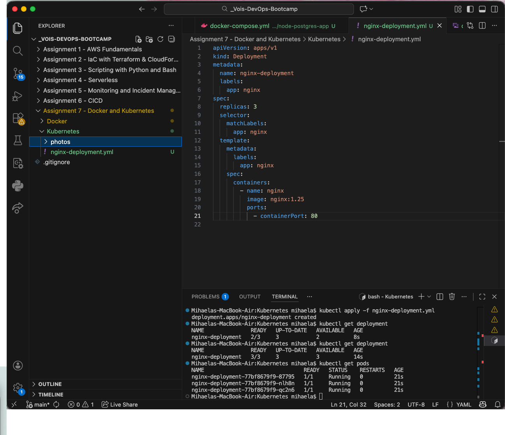

A Deployment was created with 3 replicas of NGINX and successfully applied to the cluster.
The Deployment was applied to the cluster, and its status was verified using kubectl get deployments and kubectl get pods.

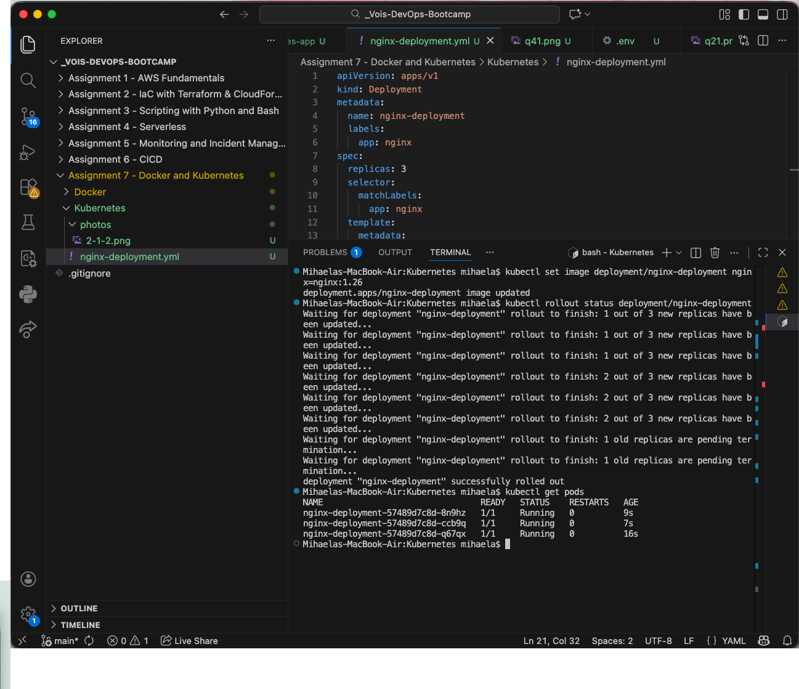

The image version was updated, triggering a rolling update, ensuring zero downtime.

---

### 3. Services & Networking

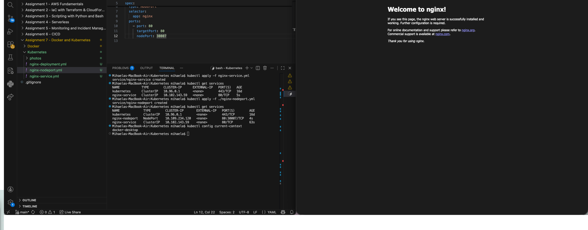

- A ClusterIP Service was created to expose the NGINX Pods internally.
- kube-proxy manages networking rules and load balancing traffic to Pods behind a Service.
- DNS in Kubernetes allows Pods to communicate using service names instead of IP addresses.
- As a bonus, a NodePort Service was deployed to expose the application externally.

---

### 4. Helm Basics

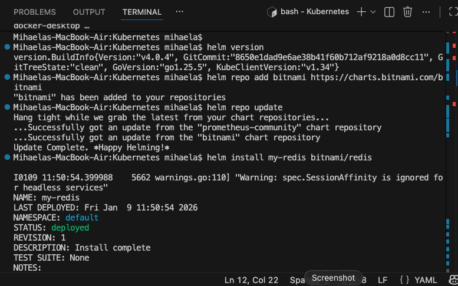
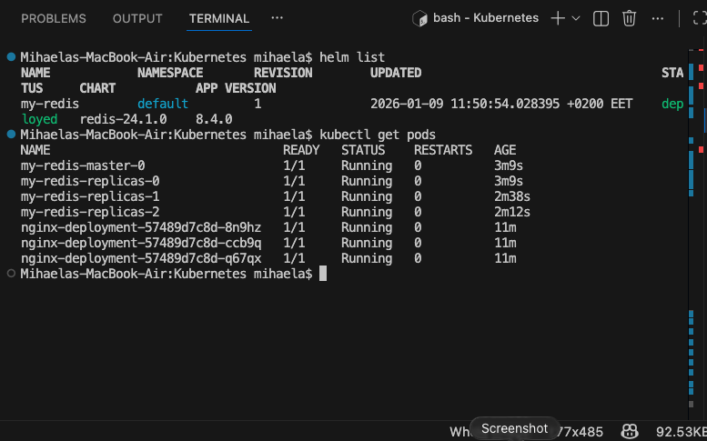

- Helm was installed and the Bitnami chart repository was added.
- Redis was deployed using a Helm chart, and the deployment was verified using kubectl get pods.
- The values.yaml file was used to customize Helm chart configuration without modifying templates.

---

### 5. Horizontal Pod Autoscaler (HPA)

The metrics-server was enabled to collect CPU metrics.

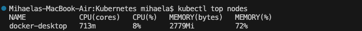

An HPA was created to scale the NGINX Deployment between 2 and 5 replicas at 50% CPU usage.

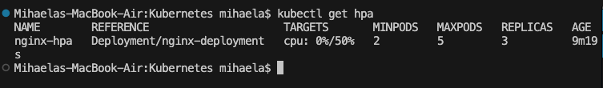

Load was simulated using a stress container, demonstrating how HPA reacts to resource consumption.

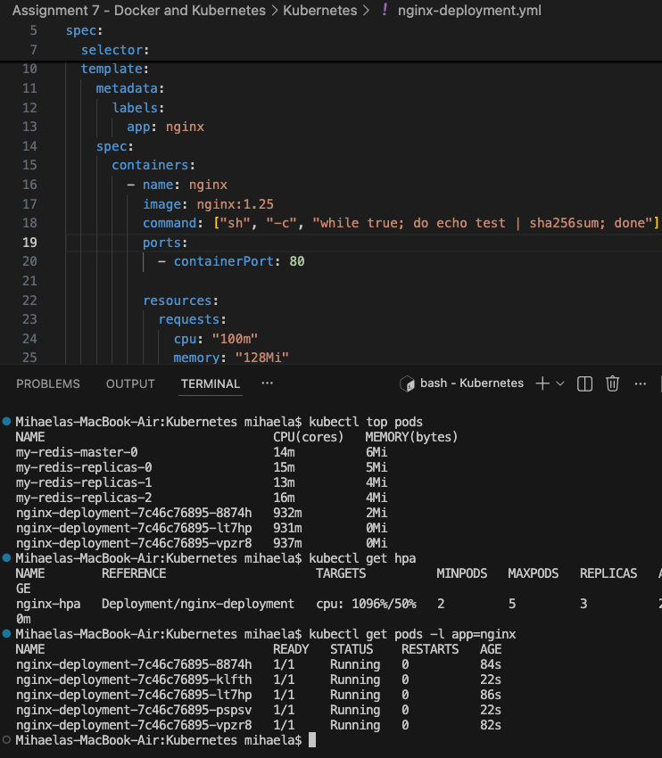

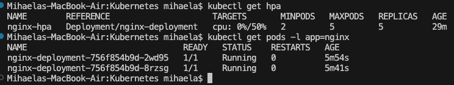

---

### 6. Monitoring & Debugging

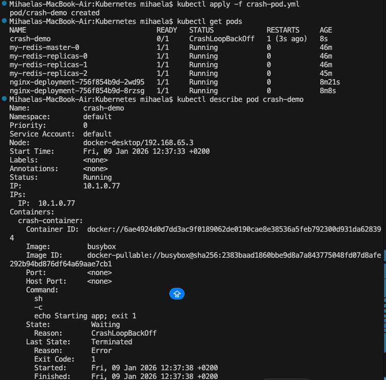

[Monitoring](Kubernetes/photos/6-1-1.png)

kubectl describe and kubectl logs were used to inspect Pod behavior and troubleshoot failures.
Common reasons for CrashLoopBackOff include:
- application crashes
- incorrect environment variables
- missing dependencies or configuration errors

In my case, I made a demo-crash pod for test.

---

### 7. EKS & IAM Integration (IRSA)
Managed Node Groups run Pods on EC2 instances managed by AWS, while Fargate runs Pods without exposing servers.
IRSA (IAM Roles for Service Accounts) was explained step by step, showing how an IAM role is associated with a Kubernetes ServiceAccount using OIDC, allowing Pods to access AWS services securely without access keys.
This was presented conceptually, as the cluster is not connected to AWS.

To demonstrate this association, a `service-account.yml` file was created, showing how an IAM
role ARN is attached to a Kubernetes ServiceAccount using annotations. Additionally, a
`deployment-app.yml` file was used to illustrate how this ServiceAccount is referenced in a
Deployment, ensuring that Pods running the application assume the permissions defined by the
IAM role.

This configuration was presented conceptually, as the Kubernetes cluster used in this
assignment is not connected to an AWS account.

---

### 8. Challenge – 2-tier App with Helm

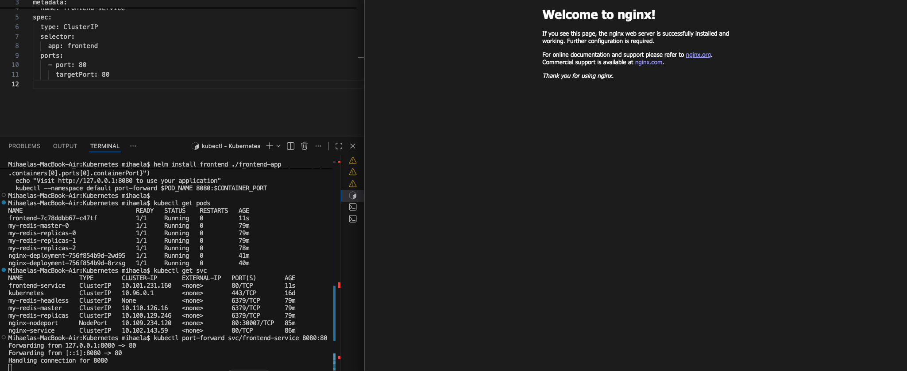

A two-tier application architecture was implemented using Helm charts, consisting of a
backend Redis service and a frontend web application. Redis was deployed using the Bitnami
Helm chart, which provisions the Redis Pods and exposes them internally through a ClusterIP
Service.

A custom Helm chart was created for the frontend application. Configuration values such as
the Redis hostname and port were defined in the frontend chart’s values.yaml file and injected
into the container as environment variables. This approach allows the frontend to dynamically
connect to the backend service without hardcoding configuration details.

Kubernetes Services play a key role in the communication between components. The frontend
application communicates with Redis through the Redis Service rather than directly addressing
individual Pods. Kubernetes DNS automatically resolves the Redis Service name to the
appropriate backend Pod endpoints, ensuring service discovery and load balancing.

Traffic flow in the system follows a layered model: client requests reach the frontend Service,
which forwards traffic to the frontend Pods. The frontend Pods then establish internal
connections to the Redis backend via its ClusterIP Service. This design ensures loose coupling,
scalability, and resilience, as Pods can be replaced or scaled independently without impacting
connectivity.
