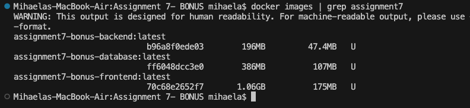
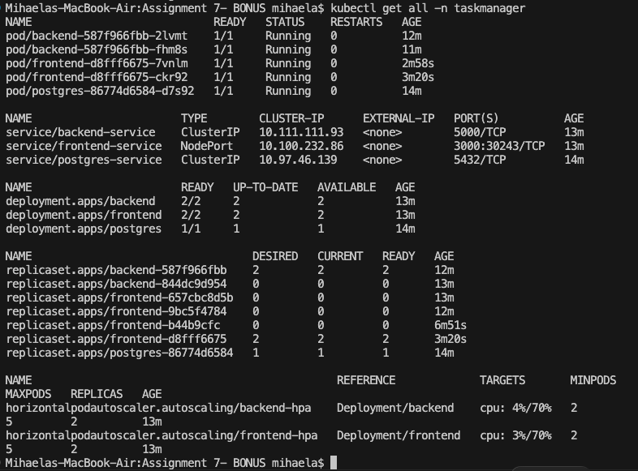
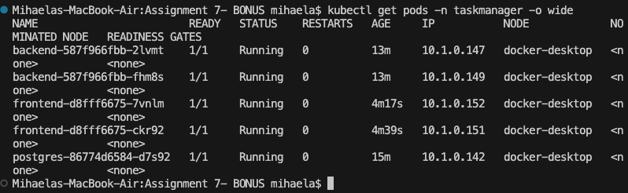
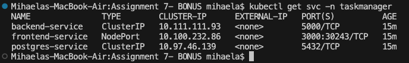
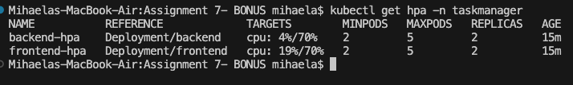
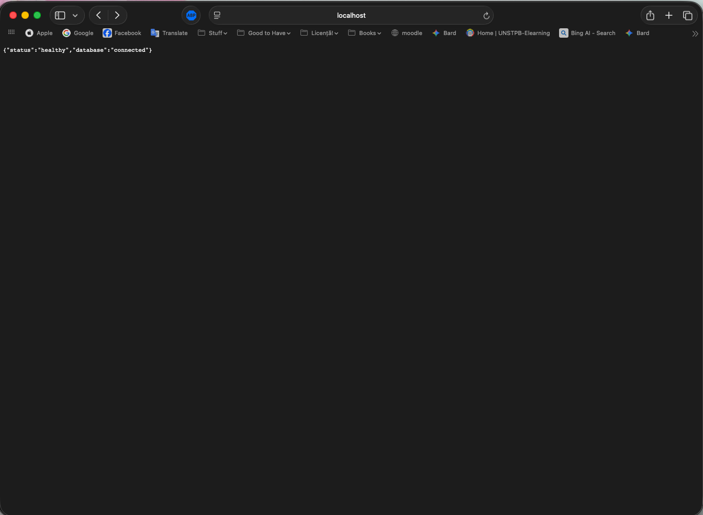
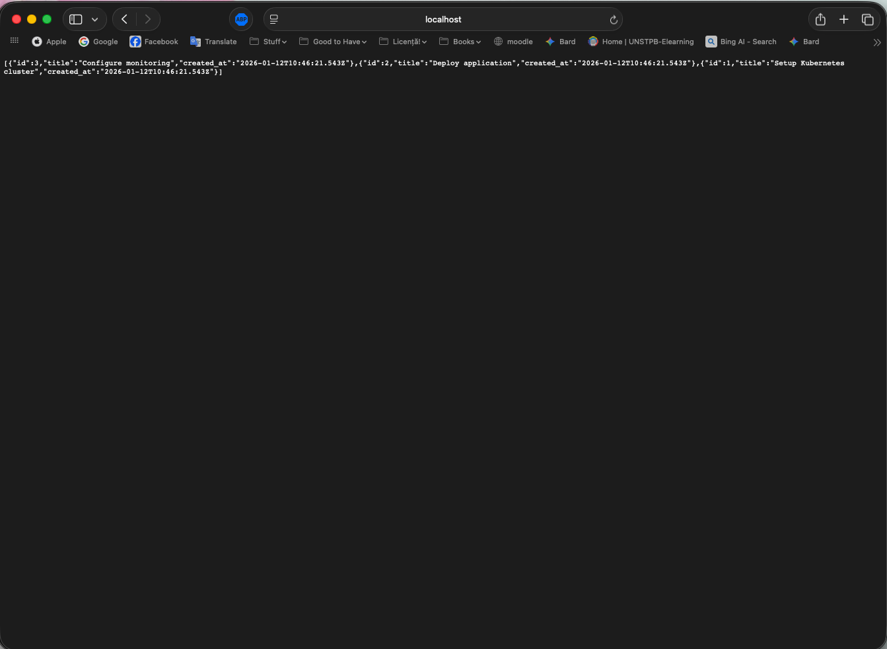
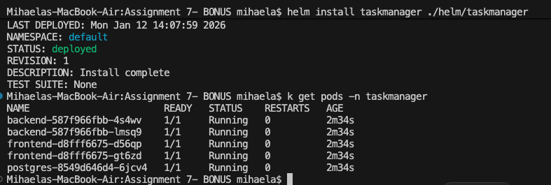
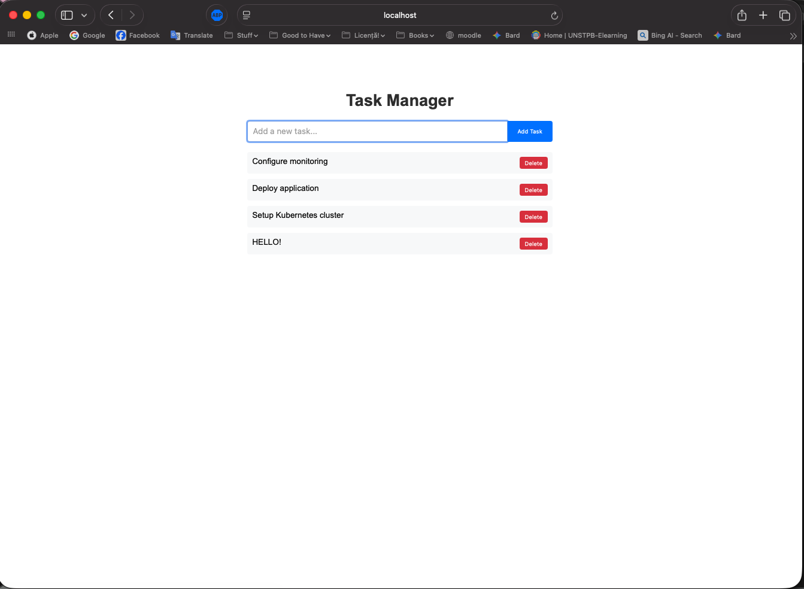

# Task Manager - Full-Stack Kubernetes Application

A complete full-stack application featuring a React frontend, Express.js backend, and PostgreSQL database, containerized with Docker and deployed on Kubernetes using industry best practices.

## Overview

This project demonstrates a complete DevOps workflow on Kubernetes. It includes:

- **Part 1**: Dockerization with multi-stage builds, health checks, and security best practices
- **Part 2**: Kubernetes deployment with ConfigMaps, Secrets, Persistent Volumes, and HPA
- **Part 3**: Helm chart packaging for reusable, configurable deployments
- **Part 4**: Documentation

## Architecture

```
┌─────────────────────────────────────────────────────────┐
│                    Kubernetes Cluster                   │
│                                                         │
│  ┌──────────────────────────────────────────────────┐   │
│  │              Ingress Controller                  │   │
│  │              (taskmanager.local)                 │   │
│  └────────────────────────┬─────────────────────────┘   │
│                           │                             │
│                 ┌─────────┴──────────┐                  │
│                 │                    │                  │
│          ┌──────▼──────┐      ┌──────▼──────┐           │
│          │  Frontend   │      │   Backend   │           │
│          │  (React)    │      │  (Express)  │           │
│          │  Port: 3000 │      │  Port: 5000 │           │
│          │  Replicas: 2│      │  Replicas: 2│           │
│          │  HPA: 2-5   │      │  HPA: 2-5   │           │
│          └─────────────┘      └──────┬──────┘           │
│                                      │                  │
│                               ┌──────▼──────┐           │
│                               │  PostgreSQL │           │
│                               │  Port: 5432 │           │
│                               │  PVC: 1Gi   │           │
│                               └─────────────┘           │
└─────────────────────────────────────────────────────────┘
```

## Features

### Docker & Containerization
-  Multi-stage builds for optimized image sizes
-  Non-root users for enhanced security
-  Health checks for all services
-  Labels and metadata for better organization
-  Makefile for reproducible builds

### Kubernetes Resources
-  Namespace isolation
-  ConfigMaps for application configuration
-  Secrets for sensitive data (base64 encoded)
-  PersistentVolumeClaim for database storage
-  Deployments with resource requests/limits
-  Services (ClusterIP, NodePort)
-  Ingress for external access
-  Horizontal Pod Autoscaler (HPA) for frontend and backend

### Helm Chart
-  Reusable templates with parameterization
-  values.yaml for easy customization
-  Proper chart structure and metadata

## Prerequisites

- Docker Desktop with Kubernetes enabled
- kubectl CLI tool
- Helm 3
- Node.js 18+ (for local development)
- Make (optional, for using Makefile)

## Getting Started

### Local Development with Docker Compose

1. **Build all images:**
   ```bash
   make build
   # or
   docker-compose build
   ```

2. **Start all services:**
   ```bash
   make up
   # or
   docker-compose up -d
   ```

3. **Access the application:**
   - Frontend: http://localhost:3000
   - Backend API: http://localhost:5001/api/tasks
   - Backend Health: http://localhost:5001/health

4. **View logs:**
   ```bash
   make logs
   # or
   docker-compose logs -f
   ```

5. **Stop services:**
   ```bash
   make down
   # or
   docker-compose down
   ```

### Kubernetes Deployment

#### Step 1: Enable Kubernetes in Docker Desktop

#### Step 2: Build Docker Images

Images are already built from Docker Compose, but you can verify:

```bash
docker images | grep assignment7-bonus
```

You should see:
- `assignment7-bonus-frontend:latest`
- `assignment7-bonus-backend:latest`
- `assignment7-bonus-database:latest`

#### Step 3: Deploy to Kubernetes

```bash
kubectl apply -f k8s/

# Verify deployment
kubectl get all -n taskmanager

# Watch pods until all are Running
kubectl get pods -n taskmanager -w
```

#### Step 4: Access the Application

```bash
Access in browser: http://localhost:3000
```

### Helm Deployment

#### Step 1: Install with Helm

```bash
# Install Helm chart
helm install taskmanager ./helm/taskmanager

# Verify installation
helm list -n taskmanager
```

#### Step 3: Check deployment status

```bash
# View Helm release status
helm status taskmanager -n taskmanager

# View all resources
kubectl get all -n taskmanager
```

#### Step 4: Access the application

```bash

Open: http://localhost:3000

```

## Screenshots

### Docker Compose


*All containers running successfully with Docker Compose*



*Built Docker images*

### Kubernetes Deployment



*All Kubernetes resources deployed in the taskmanager namespace*



*All pods in Running state*



*Kubernetes services configuration*



*Horizontal Pod Autoscaler configuration*

### Backend API



*Backend health endpoint responding*



*Tasks API returning data from PostgreSQL*

### Helm Deployment



*Successful Helm chart deployment*

### Application UI



*Working Task Manager application with add/delete functionality*

## Monitoring & Debugging

### View Logs

```bash
# Frontend logs
kubectl logs -f deployment/frontend -n taskmanager

# Backend logs
kubectl logs -f deployment/backend -n taskmanager

# Database logs
kubectl logs -f deployment/postgres -n taskmanager
```

### Check Pod Status

```bash
# Get all pods
kubectl get pods -n taskmanager

# Describe a specific pod
kubectl describe pod <pod-name> -n taskmanager

# Get events
kubectl get events -n taskmanager --sort-by='.lastTimestamp'
```

### HPA Status

```bash
# View HPA status
kubectl get hpa -n taskmanager

# Describe HPA
kubectl describe hpa frontend-hpa -n taskmanager
kubectl describe hpa backend-hpa -n taskmanager

# Watch HPA in real-time
kubectl get hpa -n taskmanager -w
```

## Technologies Used

### Frontend
- React 18.2.0
- React Scripts 5.0.1
- Nginx

### Backend
- Node.js 18
- Express.js 4.18.2
- pg (PostgreSQL client) 8.11.0
- CORS 2.8.5

### Database
- PostgreSQL 15 Alpine

### DevOps & Infrastructure
- Docker & Docker Compose
- Kubernetes
- Helm 3
- Make