# Assignment 8 - FINAL BOSS — IP SPECTRE


1. Project Overview

- Purpose: reproducible IP scanning and logging service with Terraform-managed AWS infra and a CI/CD pipeline.
- Behaviour: frontend issues scan requests; backend resolves IP and geolocation and stores logs in DynamoDB.

UI (welcome):

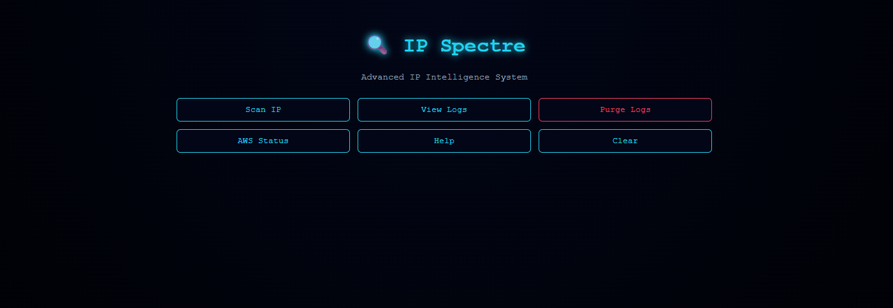

## Core Functionality & Application Logic

IP Spectre is a multi-layered intelligence tool designed to bridge the gap between simple IP lookup services and cloud infrastructure auditing. It operates as a Digital Footprint Monitor, providing deep insights into network entry points and the hosting cloud environment.

1. Real-Time IP Geolocation

- The primary function is the Scan feature. IP Spectre performs a dual-stage resolution:
	- Edge Detection: identifies the public IPv4 address of the requester using the `ipify` engine.
	- Metadata Enrichment: queries geolocation services to extract geographic coordinates (latitude and longitude), localization (city, region, country), and network context (Autonomous System and ISP).

2. Infrastructure Auditing (AWS Integration)

- The `AWS Status` module performs a self-audit using STS to identify the IAM role under which the server operates, verify region and account ID, and confirm connectivity between the compute layer (EC2) and managed AWS services. This is a diagnostic feature to validate runtime permissions.

3. Persistent Intelligence Logging

- Every successful scan is versioned and stored in DynamoDB (`ip_spectre` table): entries are timestamped in ISO 8601 UTC and include full scan metadata (IP, city, country, ISP). The Purge functionality uses DynamoDB's `batch_writer` for high-performance deletions when needed.

4. System Health & Observability

- Backend requests are logged and streamed to CloudWatch Logs (configured via the instance/user-data and Docker logging). CloudWatch Alarms monitor resource metrics (e.g. CPU) and notify the engineering team when thresholds are exceeded.

2. Architecture Diagram

- Diagram source: `terraform/infra/monitoring/cloudwatch-dashboard.json` (dashboard JSON provided).
- Logical flow: user → frontend (static) → API Gateway (proxy) → EC2 backend (port 8080) → DynamoDB. Metrics/logs → CloudWatch.

Deployment diagram (developer view):

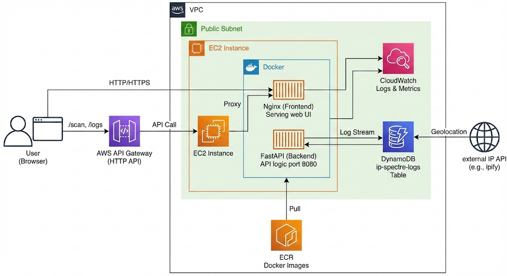

Live compute resource (EC2 view):

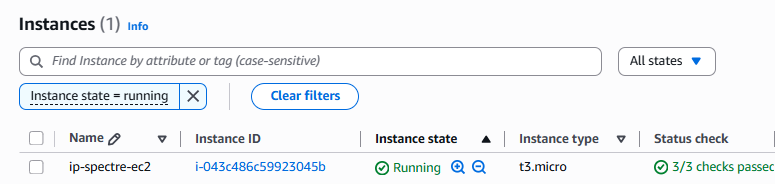

EC2 showing containers/runtime on the host:

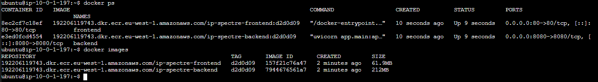

3. Technology Stack

- Docker: `backend/Dockerfile`, `frontend/Dockerfile`.
- AWS: EC2, API Gateway (proxy), DynamoDB, ECR, CloudWatch, IAM — all declared in Terraform.
- IaC: Terraform modules under `terraform/infra` and `terraform/ecr`.
- CI/CD: Azure Pipelines (`azure-pipelines.yml`).
- App: FastAPI (Python 3.11) backend, static JS frontend.

4. Repository Structure

- `backend/` — FastAPI app, services and unit tests. Key files: `backend/app/main.py`, `backend/services/aws.py`, `backend/services/logs.py`.
- `frontend/` — static UI and Dockerfile. Key files: `frontend/app.js`, `frontend/index.html`.
- `terraform/infra` — EC2, API Gateway, DynamoDB, CloudWatch, IAM, monitoring dashboard JSON.
- `terraform/ecr` — ECR repositories for backend/frontend.
- `Makefile` — local dev and Terraform helpers (install, run-backend, docker-*, tf-*).
- `azure-pipelines.yml` — CI/CD pipeline.
- `photos/` — evidence screenshots used inline in this README.

5. Local Development

Prerequisites: Docker, Python 3.11, (optional) Terraform and AWS CLI.

Start backend locally (development):

```bash
make install
make run-backend
```

Run containers locally:

```bash
make docker-build-backend
make docker-run-backend
make docker-build-frontend
make docker-run-frontend
```

Run unit tests locally:

```bash
cd backend
pip install -r requirements.txt
pytest -v
```

Local test example (console screenshot):

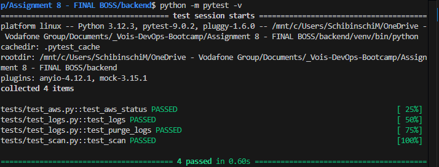

UI examples (scan, logs, purge):

Scan IP:

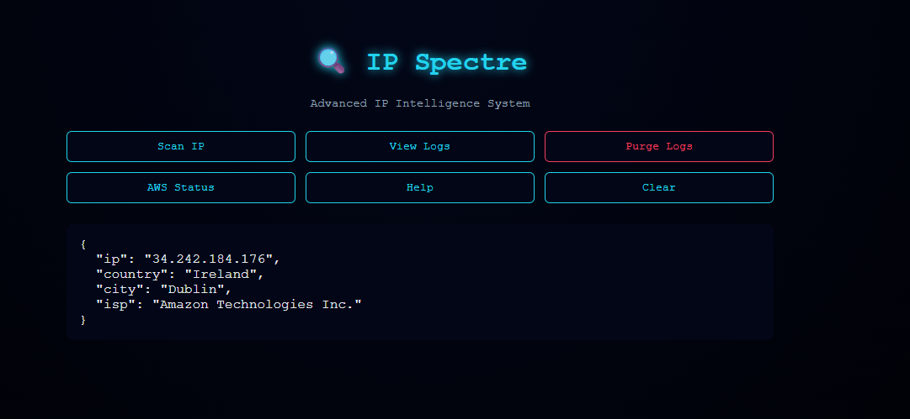

View Logs:

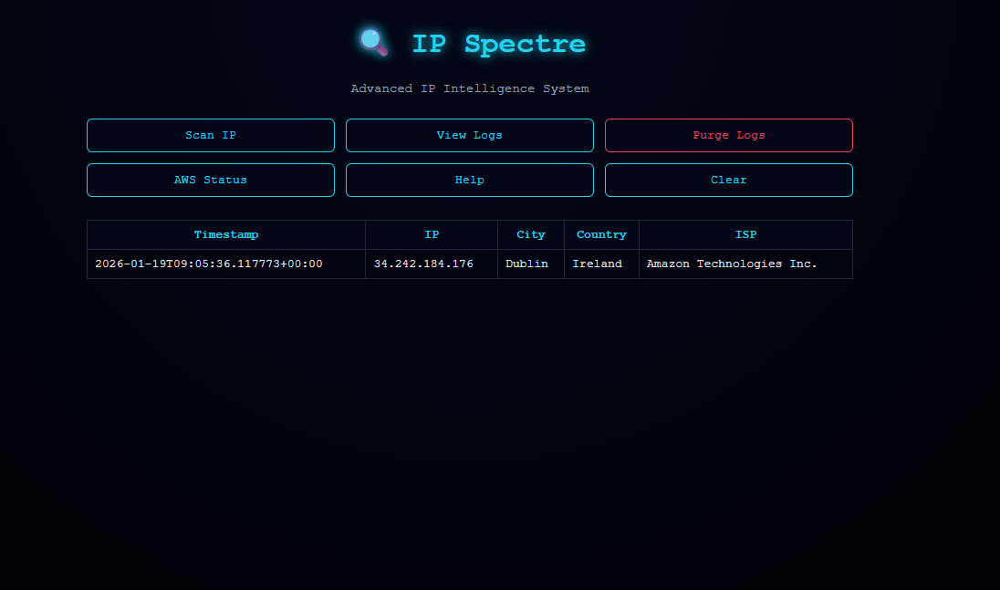

Purge logs action (UI):


Backend AWS status UI and help screens:

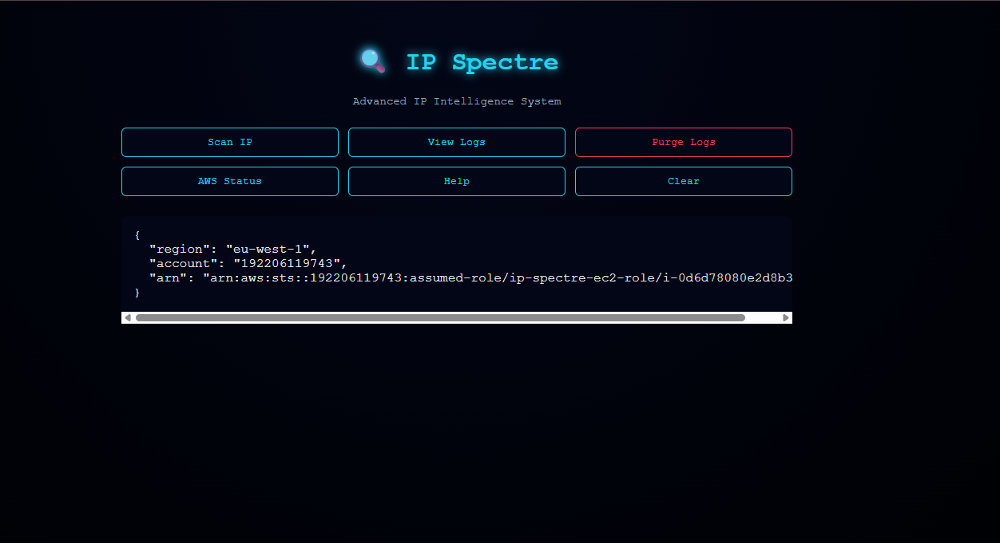

AWS help/usage screen in the UI:

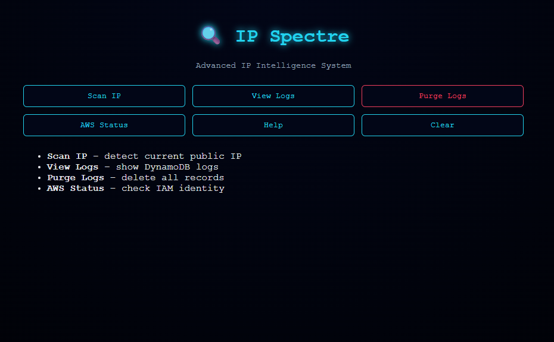

6. Infrastructure Deployment (Terraform)

Modules and purpose:

- `terraform/ecr` — create ECR repositories.
- `terraform/infra` — VPC/networking, EC2 (hosts backend container via user-data), API Gateway proxy, DynamoDB `ip_spectre`, CloudWatch dashboard & alarms, IAM.

Commands (example):

```bash
cd terraform/ecr
terraform init
terraform apply

cd ../infra
terraform init
terraform apply
```

ECR and DynamoDB evidence:

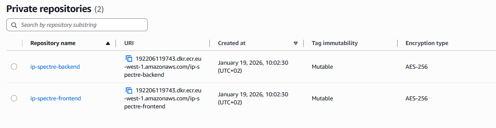

Backend ECR repository view:

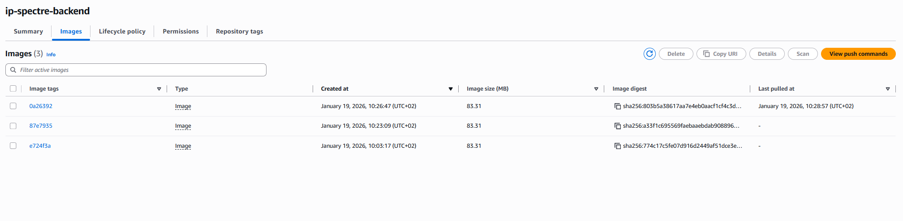

Frontend ECR repository view:

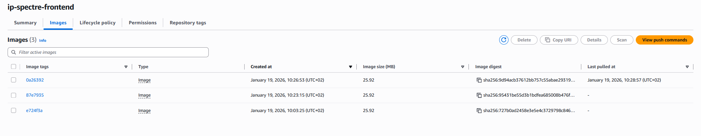

DynamoDB table view:

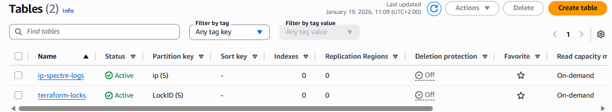

Notes: API Gateway integration uses the EC2 public IP (see `terraform/infra/api_gateway.tf`).

7. CI/CD Pipeline (Azure Pipelines)

Pipeline file: `azure-pipelines.yml`.

Implemented stages:

- CodeQuality — Python setup; `black`, `flake8`, `pylint`, `pytest`.
- InfraSetup — Terraform apply for ECR.
- BuildAndPush — Authenticate to ECR, build images, push backend/frontend.
- Deploy — Terraform apply for infra in `terraform/infra`.
- Destroy — Optional stage to destroy infra and purge ECR images (controlled by `terraformDestroy`).

Pipeline parameter screen (shows `terraformApply` and `terraformDestroy`):

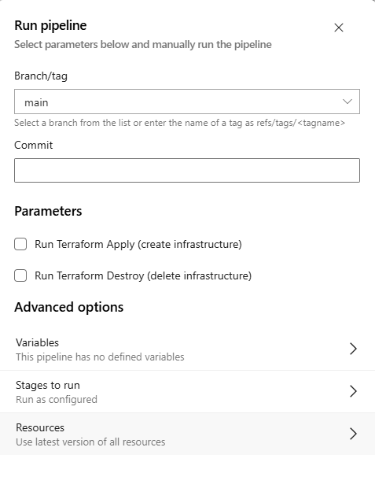

Pipeline evidence (lint, tests, deploy):

Linting & static analysis:

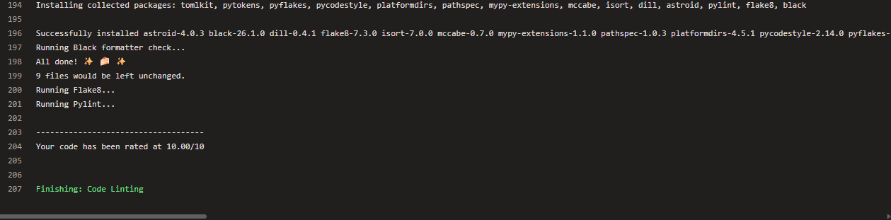

Unit tests in pipeline:

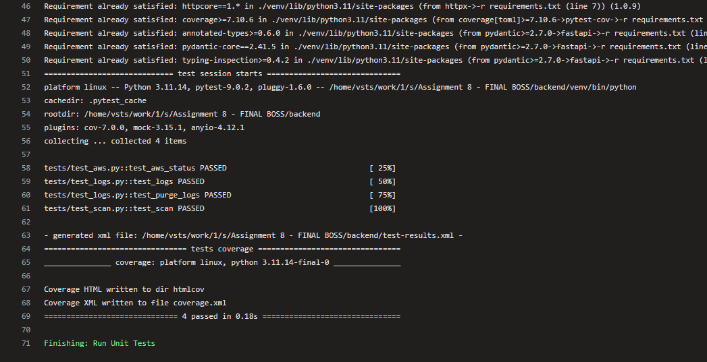

Deploy job output:

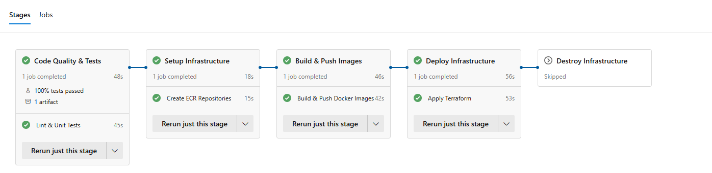

8. Monitoring & Observability

- CloudWatch dashboard JSON: `terraform/infra/monitoring/cloudwatch-dashboard.json`.
- Alarms & metric filters: `terraform/infra/cloudwatch.tf`.
- Backend logs routed to CloudWatch via instance configuration.

Dashboard screenshot:

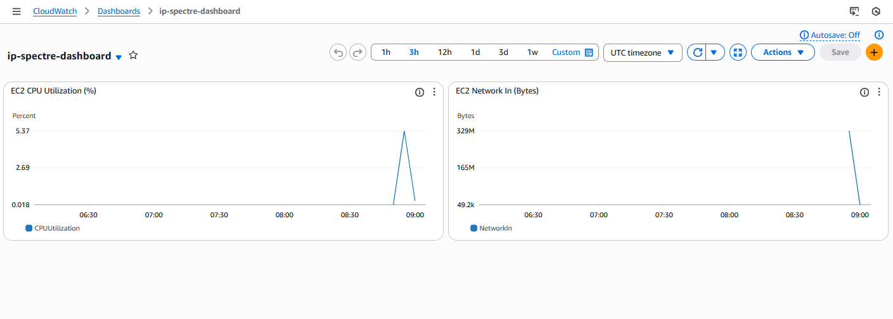

Alarms:

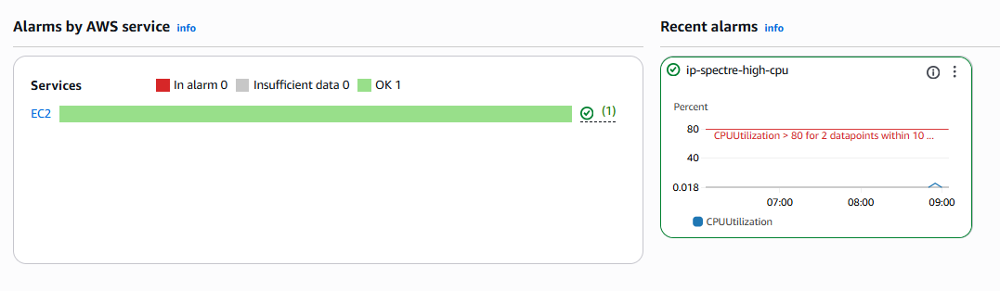

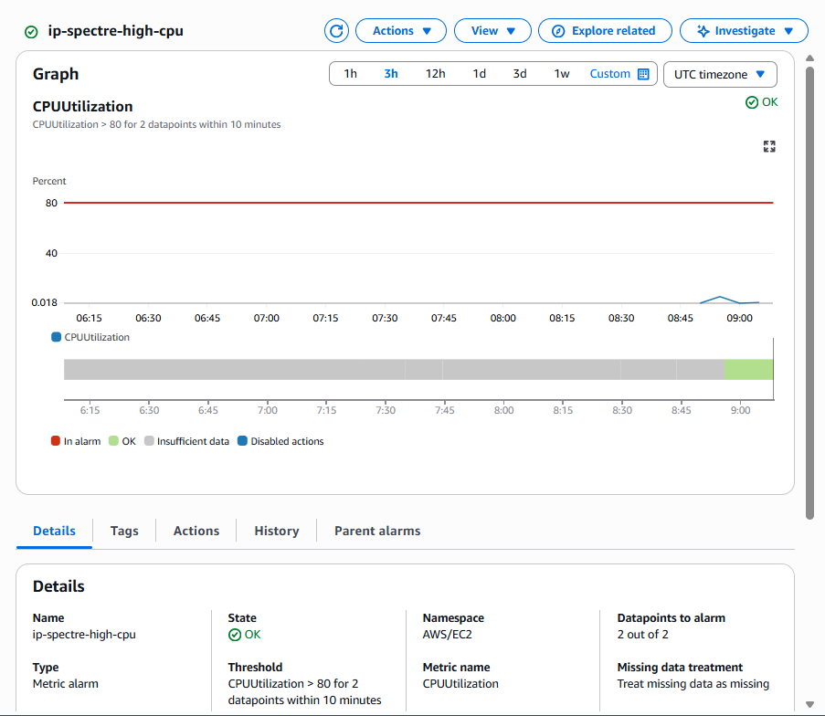

9. Serverless Components

- API Gateway: configured as a proxy to the EC2 backend (`terraform/infra/api_gateway.tf`). This provides a managed front door while compute runs on EC2.

10. Bonus / Extra Features

- External APIs: backend integrates with public IP/geo services (`backend/api/ipify.py`, `backend/api/geolocation.py`).

11. Assignment Requirement Mapping (explicit)

- Dockerised Application — `backend/Dockerfile`, `frontend/Dockerfile`, `Makefile`.
- AWS Infrastructure — implemented in `terraform/infra` (EC2, API Gateway, DynamoDB, CloudWatch, IAM).
- Terraform IaC — modules under `terraform/`.
- Makefile automations — `install`, `run-backend`, `test`, `docker-*`, `tf-init`, `tf-apply`, `tf-destroy`.
- CI/CD Pipeline — `azure-pipelines.yml` implements lint/test, ECR provisioning, build/push and deploy.
- Monitoring — CloudWatch dashboard and alarms implemented.
- Serverless — API Gateway used as proxy.

12. Cleanup / Destroy

Safe destroy sequence (local):

```bash
cd terraform/infra
terraform destroy

cd ../ecr
terraform destroy
```

Pipeline-based destroy:

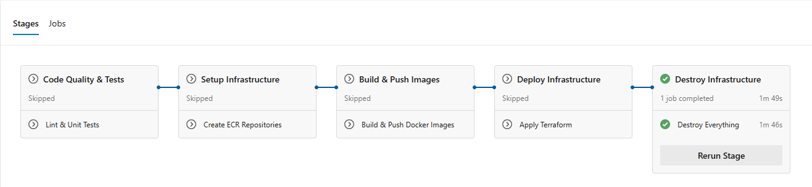
